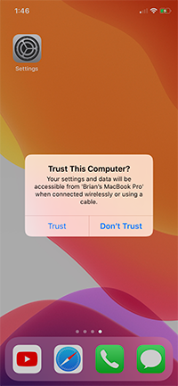
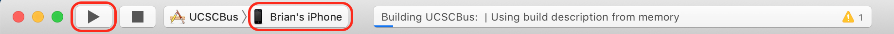
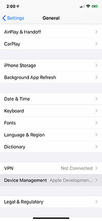
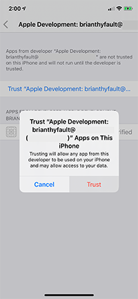
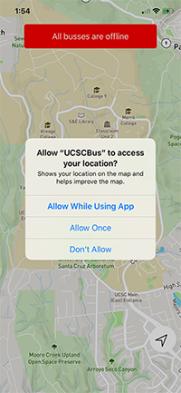
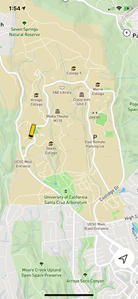

# UCSC Bus Tracker App

Developed by: 
 - Radomyr Bezghin
 - Nathan Lakritz
 - Brian Thyfault
 - Rizzian Ciprian Tuazon

# Installation

On mac:

 1. Clone the git repository:
```
    git clone https://github.com/rbezghin/UCSCBusTracker.git
```
 2. Install [CocoaPods](https://guides.cocoapods.org/using/getting-started.html) to your mac
```
    $ sudo gem install cocoapods
```
 3. Install the Pods inside project directory
```
    pod install
```
 4. Open the newly created workspace "UCSCBus.xcworkspace" in the Xcode App

# Running on iPhone
Getting project ready in project workspace:
 1. Click "UCSCBus" Project Header
 2. Under "Targets" select "UCSCBus"
 3. Go to "Signing & Capabilities" tab
 4. Change "Team" to your (Personal Team) in dropdown
 5. Create a unique "Bundle Identifier" by changing "co.rbezghin.**UCSCBus**" to anything you like. Ex "co.rbezghin.**MYBUSAPP**"
  

Running on your iPhone:
 1. Make sure your AppleID/iCloud account has been added to Xcode. Found at "Xcode"→"Preferences" under "Accounts" tab
  
 2. Connect your iPhone to mac with usb connector
 3. On your iPhone click "Trust"
  
 4. Click the play button to build and install app onto phone, make sure your phone is the selected target
  
 5. An error will appear in Xcode, Click "Ok" and grab your iPhone.
  
 6. On iPhone, go to "Settings"→"Device Management"→"Apple Development:*(Your AppleID)*"
  
 7. Tap "Trust "Apple Development: *(Your AppleID)*"", Then "Trust" once more
  
 8. Finally, play & run the app on Xcode. It should install and open the app on the connected iPhone
  
 9. Done!
  
